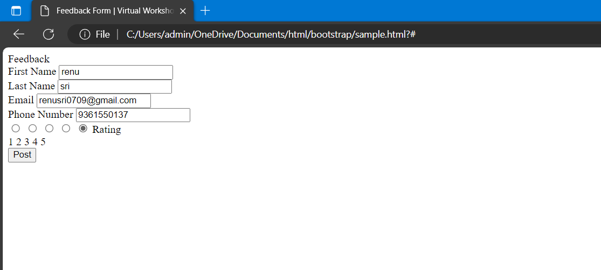
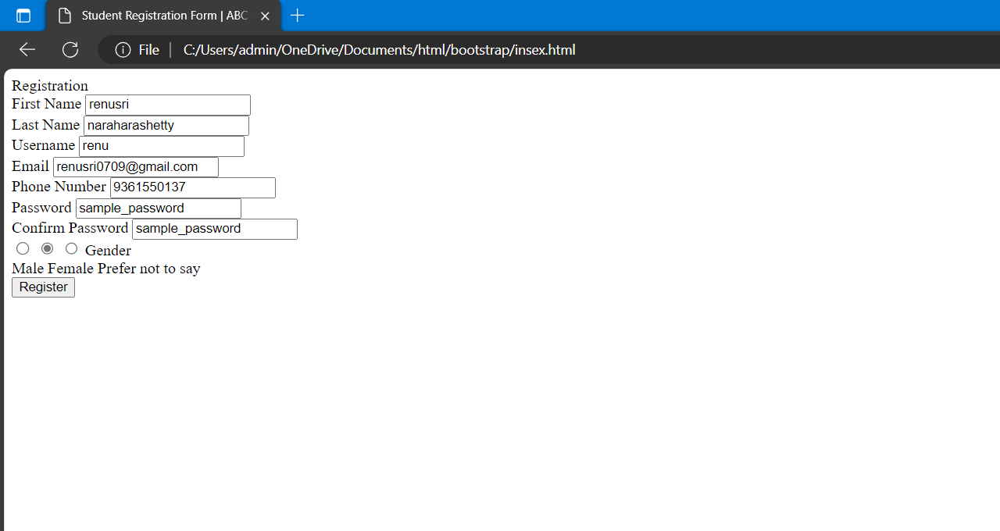
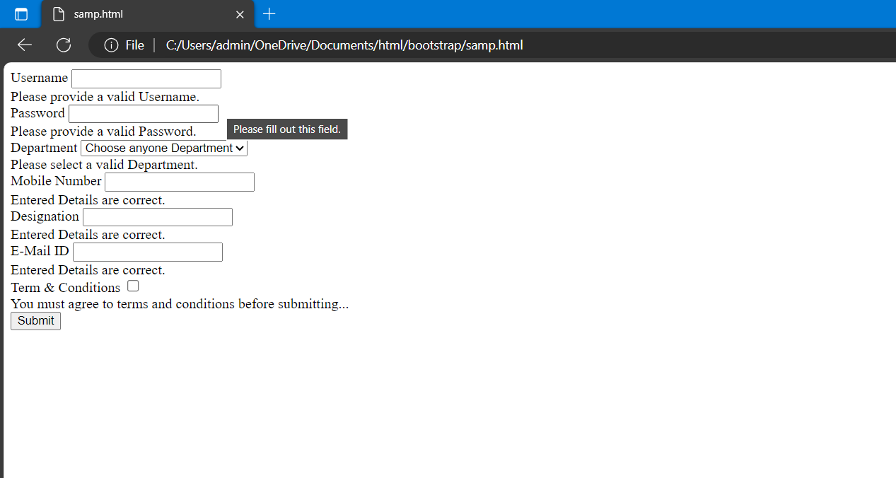
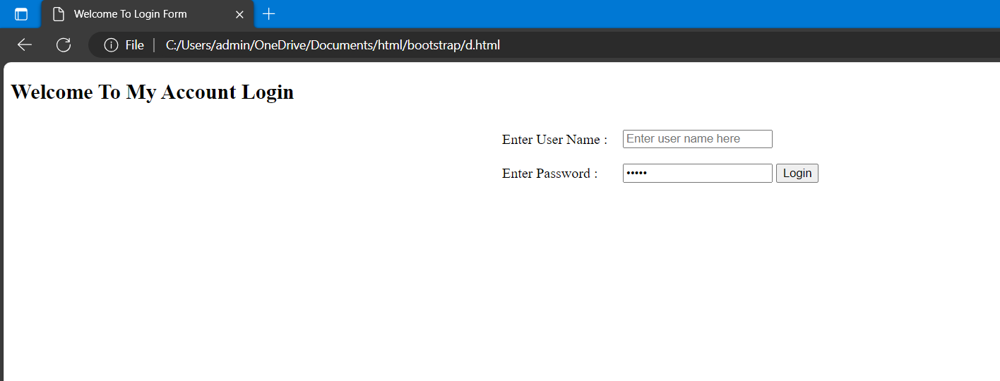

# Ex-10-BOOTSTRAP
NAME : RENUSRI NARAHARASHETTY

REGISTER NUMBER : 212223240139

DEPARTMENT : ARTIFICIAL INTELLIGENCE AND MACHINE LEARNNG

# EXP 10(a)
# AIM :
To Create a Responsive feedback form for a virtual workshop on Constructing Modern Websites built with Bootstrap.

# PROCEDURE :
# STEP 1:
Open your HTML file and include the Bootstrap CSS file.
# STEP 2:
Create a Bootstrap Container.
# STEP 3:
Apply Bootstrap Form Classes in the program.
# STEP 4:
Add Bootstrap Styles to Submit Button in the program.
# STEP 5:
Close the program and Display the Output.

# PROGRAM :
```
<html>
  <head>
    <title> Feedback Form | Virtual Workshop on Constructing Modern Websites</title>
    <link rel="stylesheet" href="style.css">
     <meta name="viewport" content="width=device-width, initial-scale=1.0">
   </head>
<body>
  <div class="container">
    <div class="title">Feedback</div>
    <div class="content">
      <form action="#">
        <div class="user-details">
         
 <div class="input-box">
            <span class="details">First Name</span>
            <input type="text" placeholder="Enter your 1st name" required>
            </div>

<div class="input-box">
            <span class="details">Last Name</span>
            <input type="text" placeholder="Enter your last name" required>
            </div>

          <div class="input-box">
            <span class="details">Email</span>
            <input type="text" placeholder="Enter your email" required>
          </div>

          <div class="input-box">
            <span class="details">Phone Number</span>
            <input type="text" placeholder="Enter your number" required>
          </div>
        </div>

        <div class="rating-details">
          <input type="radio" name="rate" id="dot-1">
          <input type="radio" name="rate" id="dot-2">
          <input type="radio" name="rate" id="dot-3">
          <input type="radio" name="rate" id="dot-4">
          <input type="radio" name="rate" id="dot-5">
          <span class="rate-title">Rating</span>

          <div class="category">
            <label for="dot-1">
            <span class="dot one"></span>
            <span class="rate">1</span>
          </label>
          <label for="dot-2">
            <span class="dot two"></span>
            <span class="rate">2</span>
          </label>

          <label for="dot-3">
            <span class="dot three"></span>
            <span class="rate">3</span>
            </label>

          <label for="dot-4">
            <span class="dot four"></span>
            <span class="rate">4</span>
            </label>

          <label for="dot-5">
            <span class="dot five"></span>
            <span class="rate">5</span>
            </label>

          </div>
        </div>
        <div class="button">
          <input type="submit" value="Post">
        </div>
      </form>
    </div>
  </div>
</body>
</html>
```

# OUTPUT :



# EXP 10(b)
# AIM :
To Create a Responsive student registration form for ABC Engineering College built with Bootstrap.

# PROCEDURE :
# Step 1:
Open your HTML file and include the Bootstrap CSS file.
# Step 2:
Create a Bootstrap Container.
# Step 3:
Apply Bootstrap Form Classes in the program.
# Step 4:
Add Bootstrap Styles to Submit Button in the program.
# Step 5:
Close the program and Display the Output.

# PROGRAM :
``` 
<html>
  <head>
    <title> Student Registration Form | ABC Engineering College </title>
    <link rel="stylesheet" href="style.css">
     <meta name="viewport" content="width=device-width, initial-scale=1.0">
   </head>
<body>
  <div class="container">
    <div class="title">Registration</div>
    <div class="content">
      <form action="#">
        <div class="user-details">
         
 <div class="input-box">
            <span class="details">First Name</span>
            <input type="text" placeholder="Enter your 1st name" required>
            </div>

<div class="input-box">
            <span class="details">Last Name</span>
            <input type="text" placeholder="Enter your last name" required>
            </div>

          <div class="input-box">
            <span class="details">Username</span>
            <input type="text" placeholder="Enter your username" required>
          </div>

          <div class="input-box">
            <span class="details">Email</span>
            <input type="text" placeholder="Enter your email" required>
          </div>

          <div class="input-box">
            <span class="details">Phone Number</span>
            <input type="text" placeholder="Enter your number" required>
          </div>

          <div class="input-box">
            <span class="details">Password</span>
            <input type="text" placeholder="Enter your password" required>
          </div>
          <div class="input-box">
            <span class="details">Confirm Password</span>
            <input type="text" placeholder="Confirm your password" required>
          </div>
        </div>
        <div class="gender-details">
            <input type="radio" name="gender" id="dot-1">
            <input type="radio" name="gender" id="dot-2">
            <input type="radio" name="gender" id="dot-3">
            <span class="gender-title">Gender</span>
  
            <div class="category">
              <label for="dot-1">
              <span class="dot one"></span>
              <span class="gender">Male</span>
            </label>
  
            <label for="dot-2">
              <span class="dot two"></span>
              <span class="gender">Female</span>
            </label>
  
            <label for="dot-3">
              <span class="dot three"></span>
              <span class="gender">Prefer not to say</span>
              </label>
  
            </div>
          </div>
          <div class="button">
            <input type="submit" value="Register">
          </div>
        </form>
      </div>
    </div>
  </body>
  </html>
  ```

  # OUTPUT :
  

# EXP 10(c)
# AIM :
To Develop a program to structure vertical form layouts which handle form validation in bootstrap.

# PROCEDURE :
# Step 1:
Open your HTML file and include the Bootstrap CSS file.
# Step 2:
Create a Bootstrap Container.
# Step 3:
Apply Bootstrap Form Classes in the program.
# Step 4:
Add Bootstrap Styles to Submit Button in the program.
# Step 5:
Close the program and Display the Output.

# PROGRAM :
```
<form>
    <div class="form-group">
    <div class="col-md-6">
                <label for="valid01" class="form-label">Username</label>
                <input type="text" class="form-control" id="valid01" required>
               <div class="invalid-feedback">
                     Please provide a valid Username.
                </div>
          </div>
    <div class="col-md-3">
                <label for="valid02" class="form-label">Password</label>
                <input type="text" class="form-control" id="valid02" required>
               <div class="invalid-feedback">
                     Please provide a valid Password.
                </div>
          </div>
    <div class="col-md-3">
                <label for="valid03" class="form-label">Department</label>
                <select class="form-select" id="valid04" required>
                      <option>Choose anyone Department</option>
                      <option>AIML</option>
                      <option>AIDS</option>
                      <option>IOT</option>
                </select>
                <div class="invalid-feedback">
                      Please select a valid Department.
                </div>
          </div>
          <div class="col-md-9">
    		<label for="valid04" class="form-label">Mobile Number</label>
    		<input type="text" class="form-control" id="valid04" required>
<div class="valid-feedback">
    Entered Details are correct.
</div>
</div>
    <div class="col-md-9">
        <label for="valid05" class="form-label">Designation</label>
        <input type="text" class="form-control" id="valid05" required>
        <div class="valid-feedback">
      Entered Details are correct.
</div>
</div>
    <div class="col-md-9">
        <label for="valid06" class="form-label">E-Mail ID</label>
        <input type="text" class="form-control" id="valid06" required>
        <div class="valid-feedback"> Entered Details are correct.
</div>
</div>
    <div class="col-md-3">
        <label for="valid07" class="form-label">Term & Conditions </label>
        <input type="checkbox" class="form-control" id="valid07" required>
        <div class="invalid-feedback">
      You must agree to terms and conditions before submitting...
</div>
</div>
<button type="button" class="btn btn-success"> Submit </button>
```

# OUTPUT :


# EXP 10(d)
# AIM :
To Create a basic email login form in Bootstrap with validation function.

# PROCEDURE :
# Step 1:
Open your HTML file and include the Bootstrap CSS file.
# Step 2:
Create a Bootstrap Container.
# Step 3:
Apply Bootstrap Form Classes in the program.
# Step 4:
Add Bootstrap Styles to Submit Button in the program.
# Step 5:
Close the program and Display the Output.

# PROGRAM :
```
<!DOCTYPE html>
<html>
<head>
<title>Welcome To Login Form</title>

<script type=”text/javascript”>
function login()
{
	var uname = document.getElementById("email").value;
	var pwd = document.getElementById("pwd1").value;
	var filter = [a-z A-Z 0-9]+@[a-z A-Z 0-9+.[a-z A-Z 0-9];
	if(uname =='' '')
	{
		alert("please enter user name.");
	}
	else if(pwd=='' '')
	{
        	alert("enter the password");
	}
	else if(!filter.test(uname))
	{
		alert("Enter valid email id.");
	}
	else if(pwd.length < 6 || pwd.length > 6)
	{
		alert("Password min and max length is 6.");
	}
	else
	{
		alert('Thank You for Login & You are Redirecting to XYZ Website');
  		window.location = "https://www.xyz.ac.in";
	}
}
//Reset Inputfield code.
function clearFunc()
{
	document.getElementById("email").value="";
	document.getElementById("pwd1").value="";
}
</script>
</head>
<body>
    <!-- Main div code -->
    <div>
    <div>
    <h2>Welcome To My Account Login</h2>
    </div>
    <!-- Login box -->
    <div>
    <table cellspacing="2" align="center" cellpadding="8" border="0">
    <tr>
    <td>Enter User Name :</td>
    <td><input type="text" placeholder="Enter user name here" id="email"></td>
    </tr>
    <tr>
    <td>Enter Password :</td>
    <td><input type="password" placeholder="Enter Password here" id="pwd1”></td>
    </tr>
    <tr>
    <td></td>
    <td>
    <input type="submit" value="Reset" onclick="clearFunc()">
    <input type="submit" value="Login" onClick="login()"></td>
    </tr>
    </table>
    </div>
    <!-- login box div ending here.. -->
    </div>
    <!-- Main div ending here... -->
</body>
</html>
```

# OUTPUT :


# RESULT :
All the programs have been run successfylly and the output has been verified.